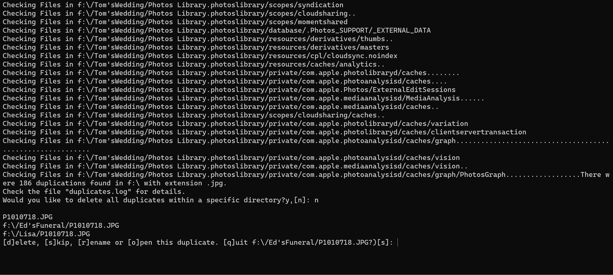
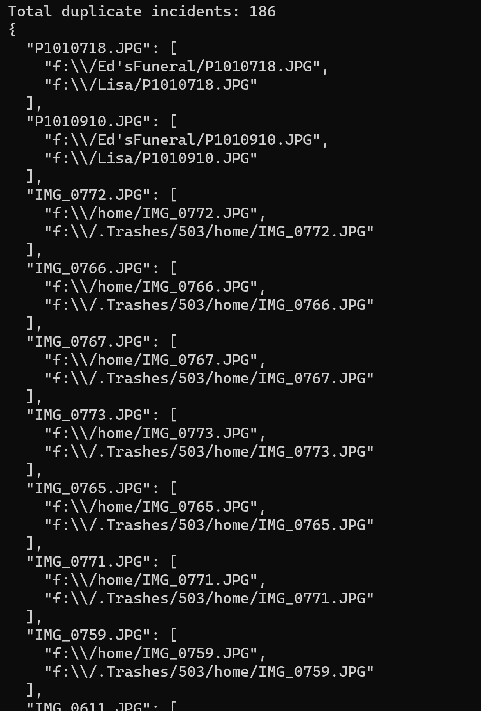

# AntiDup

Platform independent, interactive command line utility for Finding, renaming or removing duplicate files from a file system

## Requires node.js to be installed

[Download node for your system here](https://nodejs.org/en/download/)

## Features

- Use from the command line
- Search the file system recursively
- Optionally open each duplicate manually or automatically open each group of duplicates
- Filter search by file extension
- Creates a log file (duplicates.log) that contains the duplicate search results.

* Delete all duplicates in a specific file path in one key stroke

## Usage

### Command Line

`antidup string: root of search path <string: file extension> <boolean: open duplicates automatically>`

Example:

This will search all files and directories under "/" for duplicate filenames with the .jpg extension and when listing the duplicates it will open them with the default application for inspection.

`antidup / .jpg true`

The flow of the dialog would occur something like this:

- As shown in the image files are displayed as they are being checked.
- Then the option to delete all duplicates within a specific directory is displayed
- The first duplicate file is displayed along with the full path of the duplicates
- Options to delete, skip, rename or open the first duplicate are displayed as well as the option to quit.
- That process will continue for all duplicates

### duplicates.log

Everytime you run antidup a duplicates.log file is created in the directory from which antidup is executed. It contains a list of all the duplicates found in the following format.

